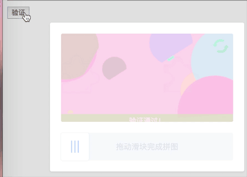

# vue-puzzle-vcode [](https://www.npmjs.com/package/vue-puzzle-vcode) [](https://www.npmjs.com/package/vue-puzzle-vcode)

Vue 纯前端的拼图人机验证、右滑拼图验证<br/> 我知道有第 3 方的很好用,比如 GEETEST
的拼图验证，但要引入 SDK 跟后台配合，还有接口交互。<br/> 太麻烦了，有时候突然改需求来不及弄，为了应付老板，就弄了个纯前端的随便验一下得了。

**DEMO**: https://isluo.com/work/vue-puzzle-vcode/




### [Vue3.x的使用文档在这](README3.md)
### 以下为Vue2.x使用文档<br/>


### 安装

```node
  npm install vue-puzzle-vcode --save
```

### 使用

```vue
import Vcode from "vue-puzzle-vcode";

<Vcode :show="isShow" @success="onSuccess" @close="onClose" />
```

### IE

我没加`babel-polyfill`,所以在 IE 里会报错：`SCRIPT1002: 语法错误`（IE 不支持箭头
函数）<br/> 需要兼容 IE 的朋友，请直接复制`src/app.vue`和`src/assets`这两个东西
到自己的项目里，给`app.vue`随便改个名字，就是个普通 vue 组件，直接用即可。<br/>
`src/assets`里是一张小图片，`app.vue`中有引用，注意自己匹配一下引用路径

### 最简单例子

```vue
<template>
  <div>
    <Vcode :show="isShow" @success="onSuccess" @close="onClose" />
    <button @click="submit">开始验证</button>
  </div>
</template>

<script>
import Vcode from "vue-puzzle-vcode";
export default {
  data() {
    return {
      isShow: false,
    };
  },
  components: {
    Vcode,
  },
  methods: {
    submit() {
      this.isShow = true;
    },

    onSuccess(msg) {
      this.isShow = false; // 通过验证后，需要手动关闭模态框
    },

    onClose() {
      this.isShow = false;
    },
  },
};
</script>
```

### 参数

| 字段         | 类型    | 默认值             | 说明                                                                          |
| ------------ | ------- | ------------------ | ----------------------------------------------------------------------------- |
| show         | Boolean | false              | 是否显示验证码弹框                                                            |
| canvasWidth  | Number  | 310                | 主图区域的宽度，单位 px                                                       |
| canvasHeight | Number  | 160                | 主图区域的高度，单位 px                                                       |
| puzzleScale  | Number  | 1                  | 拼图块(小的拼图)的大小比例，0.2 ～ 2 ，数字越大，拼图越大                     |
| sliderSize   | Number  | 50                 | 左下角用户拖动的那个滑块的尺寸，单位 px                                       |
| range        | Number  | 10                 | 判断成功的误差范围，单位 px, 滑动的距离和拼图的距离小于等于此值时，会判定重合 |
| imgs         | Array   | null               | 自定义图片，见下方例子                                                        |
| successText  | String  | "验证通过！"       | 验证成功时的提示文字                                                          |
| failText     | String  | "验证失败，请重试" | 验证失败时的提示文字                                                          |
| sliderText   | String  | "拖动滑块完成拼图" | 下方滑动条里的文字                                                            |

### 事件

| 事件名  | 返回值 | 说明                                                          |
| ------- | ------ | ------------------------------------------------------------- |
| success | 偏差值 | 验证通过时会触发，返回值是用户移动的距离跟目标距离的偏差值 px |
| fail    | 偏差值 | 验证失败时会触发，返回值同上                                  |
| close   | null   | 用户点击遮罩层的回调                                          |

### 自定义图片

```vue
<template>
  <Vcode :imgs="[Img1, Img2]" />
</template>

<script>
import Img1 from "~/assets/img1.png";
import Img2 from "~/assets/img2.png";

export default {
  data() {
    return {
      Img1,
      Img2,
    };
  },
};
</script>
```

- 也可以是网络图片完整 URL 路径，但注意图片跨域问题，因为 canvas api 无法对跨域的图片进行操作


### 说明

- 当不传递 imgs 字段或图片加载出错时，会自动生成随机图片
- 模态框的显示和隐藏完全由父级控制，所以用户通过验证后，需要手动隐藏模态框

### 更新日志
2021/10/18 - 1.1.9<br/>
- 修复：修复了在判定状态还未刷新时关闭模态框，重新打开不刷新的问题

2021/10/13 - 1.1.8<br/>
- 修复：解决了一个在safari中无法显示拼图块的问题（safari drawImage看起来像是异步操作）

2021/10/12 - 1.1.7<br/>
- 修复：重复加载图片的问题
- 修复：png图片的透明部分现在会用白色填充
- 更新：初始化时不再自动加载图片，直到show出来时再加载
- 更新：去掉了无用的id属性
